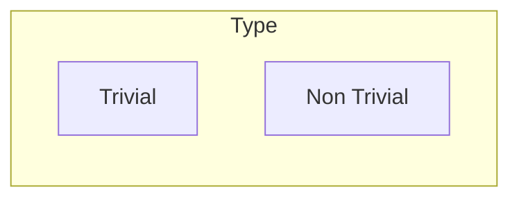
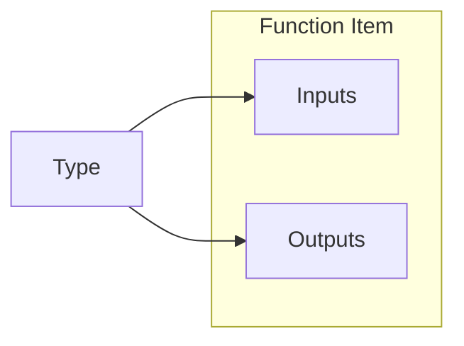
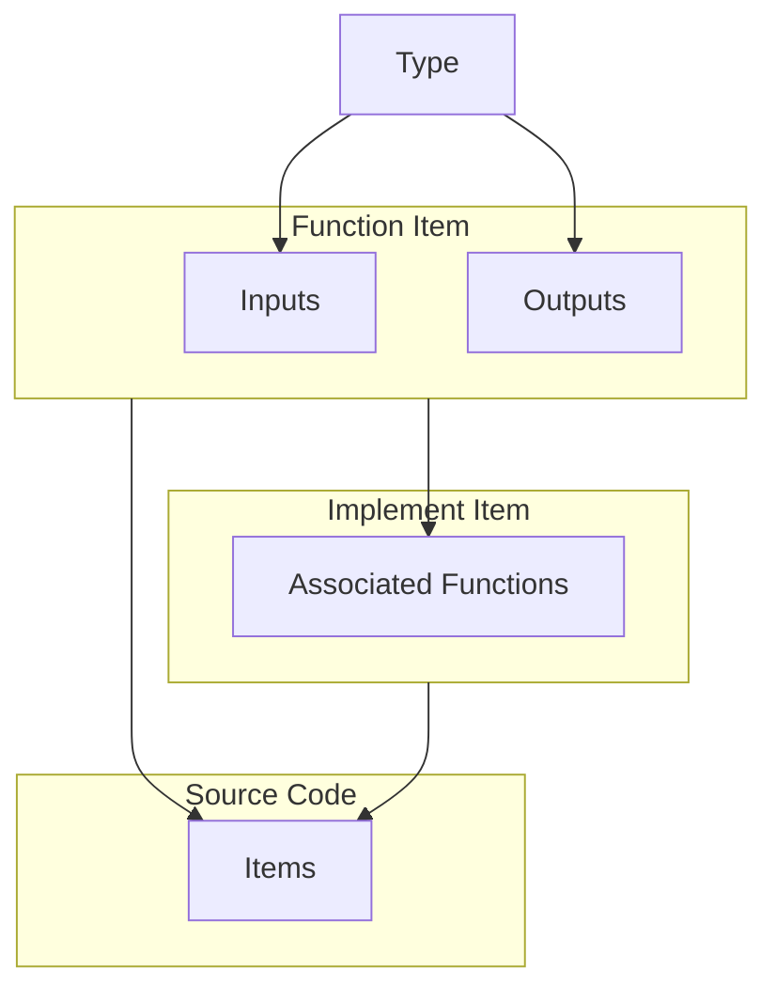

## Primer

This library contains three primary abstractions: `Type`, `FnItem`, `ImplItem`.\
`Type` represents the types that are parsed from the user's source code.\
This library classifies `Type` into two major categories: `Trivial` and `NonTrivial`

Trivial types are those that can be safely passed between FFI boundaries and are supported in both source and target language contexts. Examples of this are primitive types like `u8`, `usize`, `f64`, `bool`, and `char`.

On the other hand, non-trivial types are those that cannot be safely passed between FFI boundaries. These non-trivial types must be decomposed to their raw components. Examples are collections like `str` (in Rust, a string is a collection of bytes `u8`), `String`, `Vec<T>`, and tuples `(A, B, i32)`.

There are also pointer and reference types like `*const T`, `&mut T`, and `Box<T>`. These are technically considered trivial types since their values can be safely passed between language contexts and FFI boundaries. However, they are also considered unsafe and non-robust since the use of their values could potentially lead to undefined behavior and memory vulnerabilities.

For example, Rust has a unique language construct surrounding the concept of borrowing and ownership. In an FFI context, the other language should not violate the safety guarantees and checks of Rust. Doing otherwise leads to undefined behavior such as memory leaks and use after free bugs.

Next, an `FnItem` represents a single Rust function, which has a signature that describes its inputs and outputs. The inputs and output of a function are denoted by their `Type`

An `ImplItem` is an implementation of a type, likely a `UserDefined` type, which can contain associated `FnItem` functions

The source code consists of multiple instances of an `Item`, which could either be an `FnItem`, an `ImplItem`, or any other valid Rust item that isn't parsed by this library

