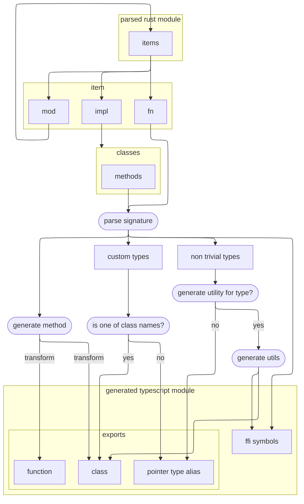

# Codegen

```mermaid
---
config:
  layout: elk
  elk:
    mergeEdges: true

---
graph TD


subgraph file[parsed rust module]
    items
end

subgraph ast_items[item]
    direction LR
    mod
    impl
    fn
end

items --> mod
items --> impl
items --> fn

mod --> items

impl --> classes
subgraph classes
    methods
end

fn --> parse_sig
methods --> parse_sig([parse signature])


parse_sig --> custom_types[custom types]
parse_sig --> rust_types[non trivial types]
parse_sig --> ffi_symbols

rust_types --> check_rust_type
check_rust_type([generate utility for type?])
check_rust_type -- yes --> generate_utils([generate utils])
generate_utils --> export_class
generate_utils --> ffi_symbols
check_rust_type -- no --> export_type


parse_sig --> generate_method([generate method])
generate_method -->| transform | export_fn
generate_method -->| transform | export_class

custom_types --> match_class([is one of class names?])
match_class -- yes --> export_class
match_class -- no --> export_type


subgraph generated[generated typescript module]
    subgraph exports
        export_fn[function]
        export_class[class]
        export_type[pointer type alias]
    end
    ffi_symbols[ffi symbols]
end

```
