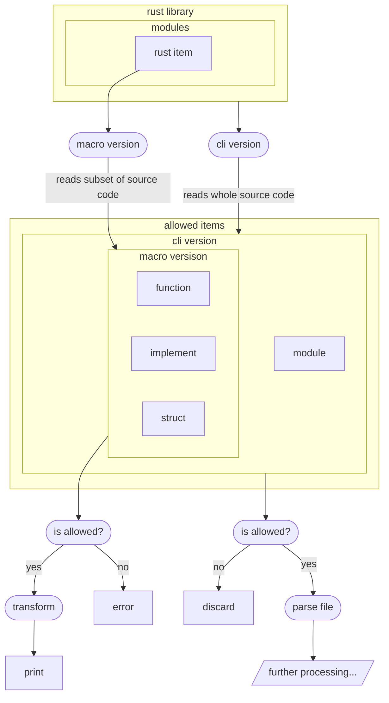

# Rust source code parsing

## Overview

```mermaid
flowchart TD


subgraph source[rust library]
    subgraph modules
        item[rust item]
    end
end

item --> macro([macro version])
source --> cli([cli version])


macro -->| reads subset of source code | macro_items
cli -->| reads whole source code | cli_items

subgraph items[allowed items]
    subgraph cli_items[cli version]
        subgraph macro_items[macro versison]
            direction LR
            function
            implement
            struct
        end

        module
    end
end

macro_items --> macro_check([is allowed?])
macro_check -->| yes | macro_transform([transform])
macro_transform --> print
macro_check -->| no | error

cli_items --> cli_check([is allowed?])
cli_check -->| no | discard
cli_check -->| yes | cli_parse([parse file])
cli_parse --> rest[/further processing.../]

```
